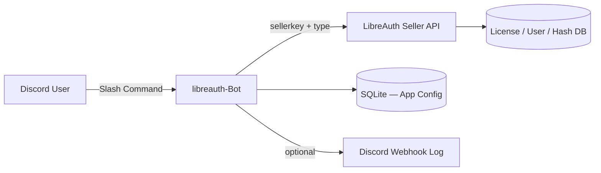

<div align="center">

# libreauth-Bot

**Discord bot สำหรับจัดการ LibreAuth Seller API — สร้างคีย์, แบน, hash whitelist, ต่ออายุ user ผ่าน Slash Commands**

[](https://nodejs.org/)
[](https://discord.js.org/)
[](https://libreauth.nutexe.dev/docs/?p=seller-api)
[](LICENSE)
[](docker-compose.yml)

[เริ่มต้นใช้งาน](#-quick-start) ·
[คำสั่งทั้งหมด](#-slash-commands) ·
[Docker](#-docker) ·
[เอกสาร LibreAuth](https://libreauth.nutexe.dev/docs/?p=seller-api)

---

บอท production-ready สำหรับเจ้าของแอป LibreAuth  
จัดการ license, user, และ file hash จาก Discord โดยไม่ต้องเปิด Panel ทุกครั้ง

</div>

---

## ✨ Features

| | |
|---|---|
| 🔑 **License Management** | สร้าง / ดู / แบน / ลบคีย์ พร้อมส่ง DM ให้ลูกค้า |
| 🛡️ **Hash Whitelist** | อัปโหลด MD5 hash หลัง build — ป้องกัน E04/E05 |
| 👤 **User Control** | ต่ออายุ subscription, รีเซ็ต HWID |
| 📦 **Multi-App** | รองรับหลาย Seller Key ต่อเซิร์ฟเวอร์ |
| 🔐 **Role Guard** | จำกัดคำสั่งด้วย role `perms` |
| 📋 **Audit Log** | Webhook log ทุกครั้งที่ gen key |
| 🐳 **Docker Ready** | Deploy บน VPS / Portainer ได้ทันที |

---

## 🏗 Architecture



```
Discord  ──►  libreauth-Bot  ──►  https://libreauth.nutexe.dev/seller-api/
                    │
                    └── SQLite (เก็บ Seller Key ต่อ Guild — ไม่ commit ลง Git)
```

---

## 📁 Project Structure

```
libreauth-Bot/
├── index.js                 # Entry point + interaction handler
├── commands/
│   ├── Licenses/            # getkey, keyinfo, ban, unban, delete, reset-hwid
│   ├── Settings/            # add/delete application, seller-info
│   ├── Hashes/              # addhash, delhash
│   └── Users/               # extend-user
├── utils/
│   ├── sellerApi.js         # LibreAuth API client (GET query)
│   ├── appResolver.js       # resolve sellerkey จากแอปที่เลือก
│   ├── registerCommands.js  # slash command registration
│   └── database.js          # SQLite via node:sqlite (built-in)
├── Dockerfile
├── docker-compose.yml
└── .env.example
```

---

## ⚡ Quick Start

### 1. Prerequisites

- [Node.js 22+](https://nodejs.org/) — ใช้ `node:sqlite` ในตัว ไม่ต้อง compile native module
- [Discord Bot Token](https://discord.com/developers/applications) — เปิด **Privileged Gateway Intents** ไม่จำเป็นสำหรับบอทนี้
- [LibreAuth Seller Key](https://libreauth.nutexe.dev/docs/?p=seller-api) — สร้างจาก Panel → Seller API

### 2. Clone & Install

```bash
git clone https://github.com/Nutexe999/libreauth-Bot.git
cd libreauth-Bot
npm install
cp .env.example .env
```

### 3. Configure `.env`

```env
TOKEN=your_discord_bot_token
TYPE=production
DEVELOPMENT_SERVER_ID=your_guild_id
LOG_WEBHOOK_URL=
```

| Mode | `TYPE` | คำอธิบาย |
|------|--------|----------|
| Production | `production` | Slash commands ทั่วทั้งบอท (แนะนำเมื่อ deploy จริง) |
| Development | `development` | คำสั่งเฉพาะ Guild — ต้องใส่ `DEVELOPMENT_SERVER_ID` |

### 4. Discord Setup

1. เชิญบอทเข้าเซิร์ฟเวอร์ — scope: `bot` + `applications.commands`
2. สร้าง role ชื่อ **`perms`** แล้วมอบให้แอดมินที่ใช้คำสั่งได้
3. รันบอท:

```bash
npm start
```

### 5. เชื่อม LibreAuth

```
/add-application sellerkey: YOUR_SELLER_KEY application: MyApp
```

บอทจะ verify key ด้วย `type=info` ก่อนบันทึก

---

## 🎮 Slash Commands

### ⚙️ Settings

| Command | Description |
|---------|-------------|
| `/add-application` | เพิ่ม Seller Key + ชื่อแอป |
| `/delete-application` | ลบแอปออกจากบอท |
| `/seller-info` | ดูข้อมูล Seller Key / แอป |
| `/reset-commands` | ลงทะเบียน slash commands ใหม่ |

### 🔑 Licenses

| Command | Description |
|---------|-------------|
| `/getkey` | สร้างคีย์ — รองรับ preset 1/3/7 วัน, lifetime, custom + ส่ง DM |
| `/keyinfo` | ดู HWID, สถานะ, ระดับ, วันที่สร้าง |
| `/bankey` | แบนคีย์ (+ ban user ที่ผูกอยู่) |
| `/unbankey` | ยกเลิกแบน |
| `/deletekey` | ลบคีย์ถาวร |
| `/reset-hwid` | รีเซ็ต HWID ของคีย์/ผู้ใช้ |

### 🛡️ Security

| Command | API `type` | Description |
|---------|------------|-------------|
| `/addhash` | `addhash` | เพิ่ม MD5 hash ลง whitelist หลัง build |
| `/delhash` | `delhash` / `resethashes` | ลบ MD5 ตัวเดียว หรือ `all` ลบทั้งหมด |

### 👤 Users

| Command | API `type` | Description |
|---------|------------|-------------|
| `/extend-user` | `extend` | ต่ออายุ subscription (`user`, `sub`, `days`) |

> คำสั่งส่วนใหญ่รองรับ option `application` — ไม่ระบุจะใช้แอปที่เลือกไว้ล่าสุด

---

## 🔌 Seller API Reference

**Endpoint**

```
https://libreauth.nutexe.dev/seller-api/
```

KeyAuth-style query API — ส่ง `sellerkey`, `type`, และ parameters ผ่าน GET

**ทดสอบ Seller Key**

```bash
curl -G 'https://libreauth.nutexe.dev/seller-api/' \
  --data-urlencode 'sellerkey=YOUR_SELLER_KEY' \
  --data-urlencode 'type=info'
```

**Mapping ที่บอทใช้**

| Bot Command | `type` |
|-------------|--------|
| verify / seller-info | `info` |
| getkey | `addkey` |
| bankey | `ban` |
| unbankey | `unban` |
| deletekey | `del` |
| reset-hwid | `resetuser` |
| addhash | `addhash` |
| delhash | `delhash`, `resethashes` (hash=all) |
| extend-user | `extend` |

📖 [LibreAuth Seller API Docs](https://libreauth.nutexe.dev/docs/?p=seller-api)

---

## 🔐 Security Best Practices

> [!CAUTION]
> **อย่า commit Seller Key ลง GitHub** — เก็บใน `.env` หรือ environment variables เท่านั้น

- ตั้ง **IP Whitelist** ใน Panel → Seller API ถ้ารันบน VPS
- จำกัด **Key Permissions** ให้ key ทำได้เฉพาะสิ่งที่บอทต้องใช้
- ใช้ role **`perms`** ใน Discord — อย่าให้ทุกคนใช้คำสั่ง admin ได้
- เปิด `LOG_WEBHOOK_URL` เพื่อ audit ทุกครั้งที่ gen key

---

## 🐳 Docker

```bash
# สร้าง .env ข้าง docker-compose.yml
docker compose up -d --build

# ดู log
docker compose logs -f libreauth-bot
```

**Environment ใน compose**

| Variable | Default |
|----------|---------|
| `TOKEN` | — (required) |
| `TYPE` | `production` |
| `DATABASE_PATH` | `/data/data.sqlite` |
| `SELLER_API_URL` | `https://libreauth.nutexe.dev/seller-api/` |

Volume `libreauth-data` เก็บ SQLite — ข้อมูลแอปไม่หายเมื่อ restart container

---

## 🛠 Environment Variables

| Variable | Required | Description |
|----------|:--------:|-------------|
| `TOKEN` | ✅ | Discord Bot Token |
| `TYPE` | ✅ | `production` หรือ `development` |
| `DEVELOPMENT_SERVER_ID` | ⚠️ | Guild ID — จำเป็นเมื่อ `TYPE=development` |
| `LOG_WEBHOOK_URL` | — | Discord Webhook สำหรับ log `/getkey` |
| `SELLER_API_URL` | — | Override API endpoint (default: LibreAuth) |
| `DATABASE_PATH` | — | SQLite path (Docker: `/data/json.sqlite`) |

---

## 🔄 อัปเดตจาก GitHub

ดึงเฉพาะไฟล์ที่จำเป็น (ไม่ทับ `.env` / `data.sqlite`):

```powershell
cd libreauth-Bot
git fetch origin
git checkout origin/main -- utils/sellerApi.js commands/Licenses/Getkey.js index.js
npm start
```

อัปเดตทั้ง repo:

```powershell
git pull origin main
npm start
```

---

## ❓ Troubleshooting

| ปัญหา | วิธีแก้ |
|-------|---------|
| Slash commands ไม่ขึ้น | รอ 1–5 นาที (global) หรือใช้ `/reset-commands` |
| `Seller Key ไม่ถูกต้อง` | ตรวจ key + IP whitelist ใน Panel |
| `ต้องมีบทบาท perms` | สร้าง role `perms` แล้วมอบให้ user |
| `Unknown seller API type` on `/getkey` | เปิดสิทธิ์ **addkey** ใน Panel → Seller API → Key Permissions |
| `/getkey` ไม่ได้ | ต้องแพ็กเกจ **Pro/Enterprise** ถึงจะใช้ Seller API ได้ |
| บอท offline หลัง deploy | ตรวจ `TOKEN` ใน env — อย่า commit `.env` |

---

## 📚 Links

- [LibreAuth Documentation](https://libreauth.nutexe.dev/docs/)
- [Seller API](https://libreauth.nutexe.dev/docs/?p=seller-api)
- [Discord Developer Portal](https://discord.com/developers/applications)

---

## 📄 License

MIT © [Nutexe999](https://github.com/Nutexe999)

---

<div align="center">

**Made for [LibreAuth](https://libreauth.nutexe.dev/) · discord.js v14 · Production-ready**

⭐ Star repo ถ้าใช้งานแล้วชอบ

</div>
